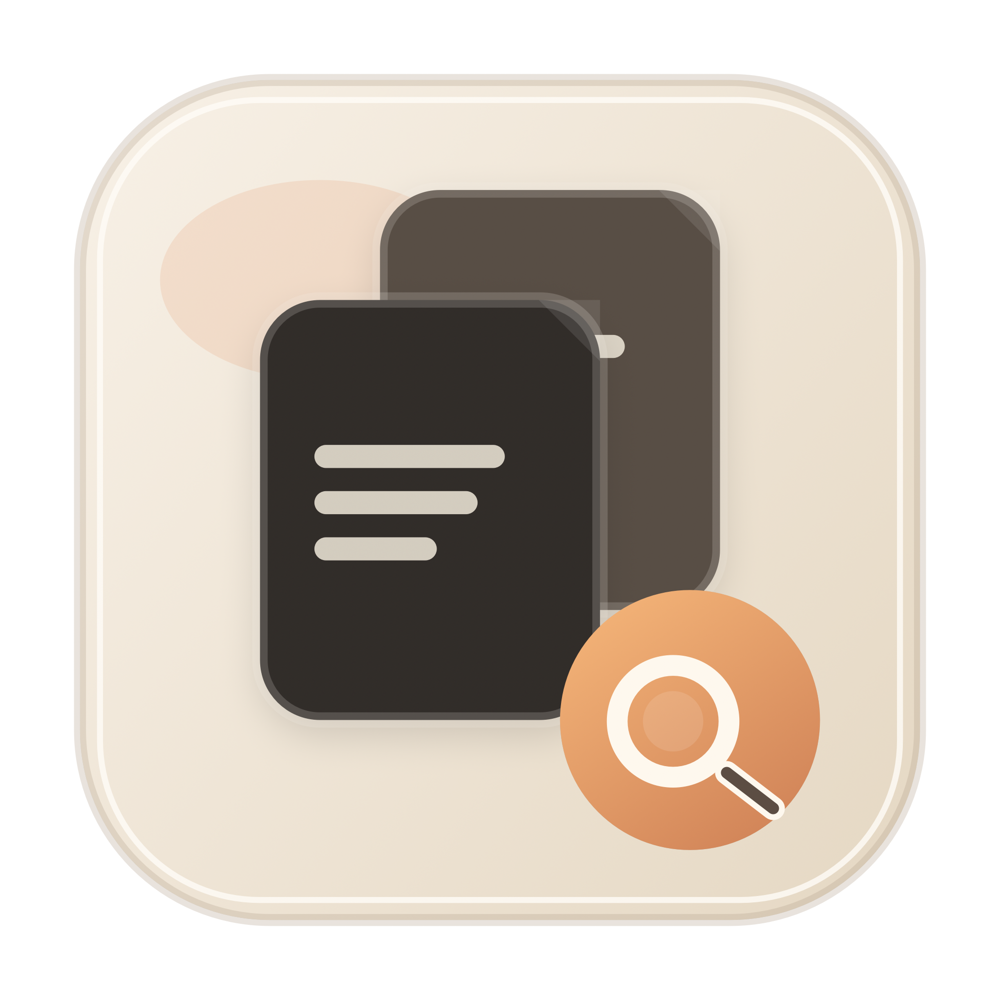

# DuplicateMe

[](https://github.com/yashafake/duplicate-me/actions/workflows/ci.yml)
[](LICENSE)
[](#requirements)

Local-first duplicate and similar file finder for macOS with a Swift engine and Electron desktop shell.



## Highlights

- Exact duplicate detection with staged hashing (`size -> sample hash -> full SHA-256`).
- Similarity detection for images, videos, and audio.
- Local review UI with cluster filtering, suppression, previews, and quick cleanup actions.
- SQLite-backed scan history, cache, and ignore rules.
- CLI and desktop shell powered by the same core engine.

## Requirements

- macOS (Apple Silicon or Intel)
- Swift toolchain (Xcode Command Line Tools or Xcode)
- Node.js 20+ and npm (desktop shell packaging and dev mode)

## Architecture

- `MediaFingerprint`: media fingerprinting and similarity scoring.
- `ScanCore`: orchestration, clustering, review suppression, HTML export, trash flow.
- `ScanStore`: SQLite persistence for scans, cache, and ignore rules.
- `ScanCLI`: CLI surface and local review server.
- `electron/`: native desktop shell over the local Swift backend.

## Quick Start

### 1) Build and run tests

```bash
swift build
swift test
```

### 2) Scan a folder

```bash
swift run duplicate-me scan --location ~/Downloads
```

### 3) Open review UI

```bash
swift run duplicate-me serve
```

## CLI Commands

```bash
swift run duplicate-me help
```

Common commands:

```bash
swift run duplicate-me scan --location ~/Downloads --similar-images --similar-videos --similar-audio
swift run duplicate-me rescan
swift run duplicate-me export-json --run-id <RUN_ID> --output report.json
swift run duplicate-me export-html --run-id <RUN_ID> --output report.html
swift run duplicate-me ignore add --path ~/Downloads/cache --scope folder
swift run duplicate-me ignore list
swift run duplicate-me trash --run-id <RUN_ID> --cluster <CLUSTER_ID> --member <FILE_ID>
```

## Desktop App (Electron Shell)

Run desktop dev mode:

```bash
npm install
npm run desktop:dev
```

Build distributables:

```bash
npm run desktop:dir
npm run desktop:dmg
```

Build outputs:

- app bundle: `dist/electron/mac-arm64/DuplicateMe.app`
- disk image: `dist/electron/DuplicateMe-0.1.0-arm64.dmg`

Launch packaged app:

```bash
open dist/electron/mac-arm64/DuplicateMe.app
```

### Optional notarization

`npm run desktop:dmg` attempts notarization automatically if credentials are configured.

Credential options:

1. Keychain profile

```bash
export APPLE_NOTARY_PROFILE="DuplicateMeNotary"
```

2. Apple ID + app-specific password

```bash
export APPLE_ID="you@example.com"
export APPLE_APP_SPECIFIC_PASSWORD="xxxx-xxxx-xxxx-xxxx"
export APPLE_TEAM_ID="TEAMID1234"
```

Manual commands:

```bash
npm run desktop:notarize:app
npm run desktop:notarize:dmg
```

## Data and Safety Notes

- Scan database and cache live in `~/.duplicate-me/store.sqlite`.
- Review actions are local and operate on your filesystem.
- `serve` binds to localhost for local review sessions.

## Contributing

Contributions are welcome. See [CONTRIBUTING.md](CONTRIBUTING.md) for setup, workflow, and pull request guidance.

## Security

Please report security issues responsibly. See [SECURITY.md](SECURITY.md).

## License

MIT. See [LICENSE](LICENSE).
